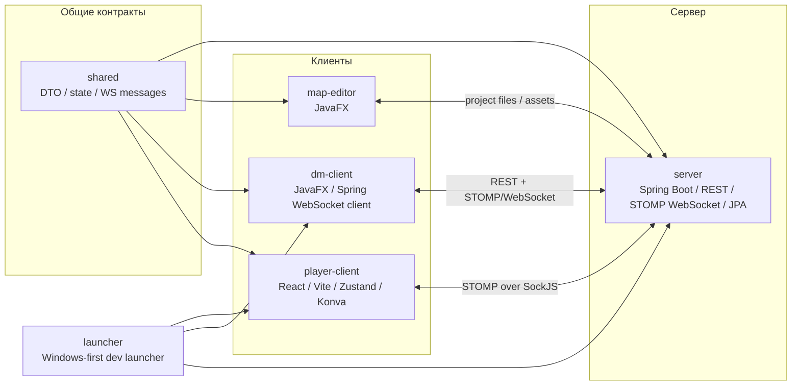
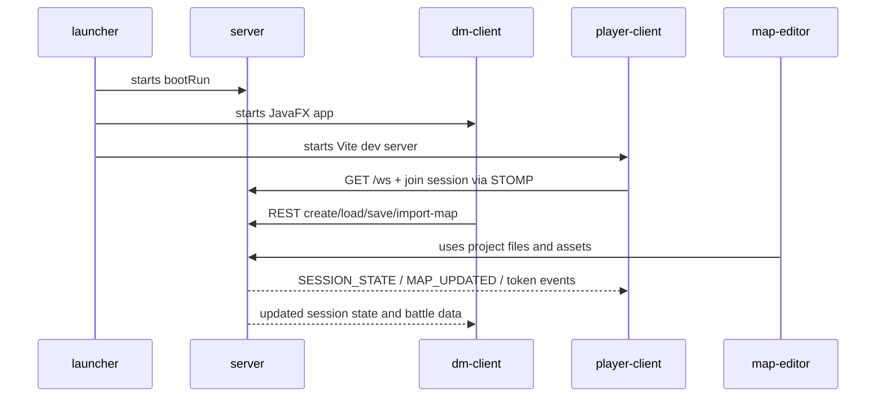

# Avalon

Avalon — это локальная multiplayer-платформа для настольных RPG-сессий с редактором карт, realtime-синхронизацией через WebSocket, системой комнат, Fog of War, стенами/коллизиями, инициативой и боевым режимом.

Проект сознательно ориентирован на небольшую группу игроков и мастера. В текущей версии в нём **нет** регистрации, авторизации и ролей, потому что это не публичный SaaS, а прикладной инструмент для живых встреч.

## Что входит в проект

- **player-client** — клиент игрока на React + TypeScript + Vite + Zustand.
- **dm-client** — настольный DM-клиент на Java + JavaFX.
- **map-editor** — отдельный JavaFX-редактор карт и рабочих пространств.
- **server** — Spring Boot backend с REST и WebSocket/STOMP.
- **shared** — общий контрактный модуль с DTO и моделями состояния.
- **launcher** — утилита запуска связки модулей для локальной разработки.

## Архитектура



## Взаимодействие модулей



## Требования

- Java 17.
- Node.js LTS для `player-client`.
- npm.
- Git.
- Windows рекомендуется для одного-командного запуска через `launcher`, потому что launcher использует `cmd`, `gradlew.bat` и `npm.cmd`.

## Быстрая установка

```bash
git clone https://github.com/svrdlrk/Avalon.git
cd Avalon
./gradlew build
cd player-client
npm install
cd ..
```

### Если нужен только сервер и клиенты по отдельности

```bash
./gradlew :server:bootRun
./gradlew :dm-client:run
./gradlew :map-editor:run
cd player-client
npm run dev -- --host 0.0.0.0 --port 5173 --strictPort
```

### Если нужен локальный запуск проекта «целиком»

```bash
./gradlew :launcher:run
```

## Конфигурация окружения

| Область | Переменная / параметр | Назначение |
|---|---|---|
| player-client | `VITE_AVALON_SERVER_URL` | Базовый URL сервера для Vite-клиента |
| player-client | `VITE_AVALON_LAUNCHER_CONTROL_URL` | URL control-сервера launcher'а |
| dm-client | `AVALON_SERVER_URL` / `avalon.serverUrl` | Базовый URL backend |
| dm-client | `AVALON_PLAYER_CLIENT_URL` / `avalon.playerClientUrl` | URL player-client |
| launcher | `AVALON_LAUNCHER_SESSION` / `avalon.launcher.session` | Идентификатор сессии launcher'а |
| launcher | `AVALON_LAUNCHER_CONTROL_URL` | Адрес control-сервера launcher'а |
| map-editor | `--project` | Открыть проект при старте |
| map-editor | `--assets` / `avalon.assets.dir` | Переопределить каталог ассетов |

## Структура проекта

```text
.
├── build.gradle
├── settings.gradle
├── launcher/
├── server/
├── shared/
├── dm-client/
├── map-editor/
└── player-client/
```

### Назначение каталогов

| Каталог | Назначение |
|---|---|
| `shared/` | Общие DTO, state-модели и WebSocket-контракты |
| `server/` | REST + WebSocket backend, синхронизация состояния сессии |
| `dm-client/` | DM-панель: подключение к сессии, загрузка/сохранение, импорт карты |
| `map-editor/` | Отдельный редактор карт, слоёв, стен, Fog of War и ассетов |
| `player-client/` | Клиент игрока: просмотр баттл-карты и синхронизированное состояние |
| `launcher/` | Локальный orchestrator для запуска связки модулей |

## Как это работает

1. `launcher` поднимает `server`.
2. После старта сервера он запускает `dm-client`.
3. Затем запускает `player-client` и открывает браузер.
4. DM создаёт или загружает сессию.
5. Игрок подключается по ссылке/ID сессии.
6. Сервер рассылает изменения состояния через WebSocket/STOMP.
7. Клиенты обновляют карту, токены, visibility и инициативу без ручной синхронизации.

## Руководство по разработке

### Сервер

```bash
./gradlew :server:bootRun
```

### DM-клиент

```bash
./gradlew :dm-client:run
```

### Редактор карт

```bash
./gradlew :map-editor:run
```

### Player-client

```bash
cd player-client
npm install
npm run dev
```

### Проверка сборки

```bash
./gradlew build
cd player-client
npm run build
npm run lint
```

## Руководство по деплою

Текущая версия рассчитана на локальный или LAN-сценарий без публичной авторизации и без контейнеризации.

Рекомендуемый порядок запуска:
1. Поднять `server`.
2. Запустить `dm-client`.
3. Запустить `player-client`.
4. При необходимости открыть `map-editor` для подготовки карт.

[TODO: ОПИСАТЬ сценарий деплоя, если проект когда-либо будет разворачиваться вне локальной сети.]
